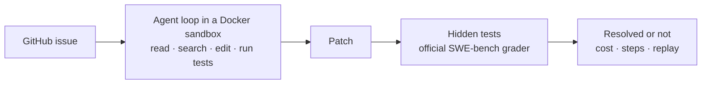

# repo-bug-hunter

[](https://pypi.org/project/repo-bug-hunter/)
[](https://github.com/Manishmaurya89/repo-bug-hunter/actions/workflows/tests.yml)
[](LICENSE)
[](https://codespaces.new/Manishmaurya89/repo-bug-hunter)

An AI coding agent that fixes real GitHub bugs, and a lab that measures how well it does it.

Give it a GitHub issue and it works the way a developer would: it explores the repository, reproduces the bug, edits the code and runs the tests until it can submit a fix. The fix is then graded by the project's own hidden tests from [SWE-bench Verified](https://www.swebench.com/), and every step the agent took can be replayed in the browser.



## What it does

- Fixes bugs from real GitHub issues inside a Docker sandbox, using six simple tools.
- Grades each fix with the tests the project's maintainers wrote for the real fix.
- Replays every run step by step on a static web page.
- Compares two versions of the agent on the same tasks, with paired statistics.
- Builds new tasks from merged GitHub pull requests, to test on bugs newer than the model.
- Works with Claude, any OpenRouter model, local models in Ollama, or any OpenAI-compatible server.

The agent is deliberately small: one file of under 200 lines, a plain loop around a chat model, with no agent framework, so every prompt and tool call is easy to follow. The sandbox is the same Docker image the grader uses and has no network, so the agent can't install packages or look up the real fix.

## Quick start

You need Python 3.10+ and Docker, with about 30 GB of free disk space, since each task's Docker image is a few GB. On Apple Silicon, turn on Rosetta in Docker Desktop's settings; the images are x86-64.

```bash
pip install repo-bug-hunter          # or: uv tool install repo-bug-hunter
export OPENROUTER_API_KEY=...        # from openrouter.ai/settings/keys; see Models for Claude
repo-bug-hunter doctor               # checks Docker, disk, the model and the key
repo-bug-hunter smoke                # fixes a toy bug end to end, in a few minutes
```

Then run it on real bugs. Results go to `runs/` in the current folder:

```bash
repo-bug-hunter run --name pilot --n 5 --difficulty "<15 min fix"
repo-bug-hunter evaluate runs/pilot     # grade with the official SWE-bench harness
repo-bug-hunter analyze runs/pilot      # resolve rate, cost, steps, why tasks failed
repo-bug-hunter viewer runs/pilot       # build the replay site in ./site
python3 -m http.server -d site 8000     # open http://localhost:8000
```

### Without installing anything

- **GitHub Actions:** fork this repository and enable workflows in the fork's **Actions** tab. Add `OPENROUTER_API_KEY` under **Settings → Secrets and variables → Actions**, and set **Settings → Pages → Source** to **GitHub Actions**. Then run the **experiment** workflow. Each task runs on its own GitHub machine, the official grader scores it, and the replay site is published to your GitHub Pages.
- **Codespaces:** click the badge at the top for a ready-made environment in the browser, then run the commands above with `uv run` in front, such as `uv run repo-bug-hunter doctor`.

## The test-first experiment

The question this project was built to answer: does an agent fix more bugs if it must first reproduce the bug with a failing test?

In `test_first` mode, the harness enforces it, not the prompt:

1. Source files are locked until the agent registers a test command that fails on the current code.
2. When the agent submits, the harness runs that test again. If it still fails, the submission is sent back once.
3. So the agent can't get stuck: after three tests that don't fail, the source unlocks anyway, and a second submit is always accepted.

Run both modes on the same tasks and compare:

```bash
repo-bug-hunter run --name baseline   --variant baseline   --n 50
repo-bug-hunter run --name test_first --variant test_first --n 50
repo-bug-hunter evaluate runs/baseline && repo-bug-hunter evaluate runs/test_first
repo-bug-hunter analyze runs/baseline runs/test_first --out results.md
```

The report pairs the two runs task by task, using McNemar's exact test and a bootstrap confidence interval for the difference, so noise from a small sample isn't mistaken for an improvement.

## How it works

- [agent.py](repo_bug_hunter/agent.py) is the loop. It sends the conversation to the model, runs the tools the model asks for, and repeats until the agent submits or hits a step or cost limit. With Claude it uses prompt caching and adaptive thinking.
- [tools.py](repo_bug_hunter/tools.py) has the tools (`read_file`, `search`, `edit_file`, `write_file`, `bash`, `submit`), the test-first gate, and the code that turns the final repository into a patch.
- [env.py](repo_bug_hunter/env.py) runs everything in the task's own SWE-bench Docker image, without network access, and caps output, file reads and processes so a runaway command can't hurt the machine.
- [evaluate.py](repo_bug_hunter/evaluate.py) grades with the official harness. A bug counts as fixed only if the hidden tests for the real fix pass and nothing that passed before breaks.
- [analyze.py](repo_bug_hunter/analyze.py) reports the resolve rate, cost and steps, and gives every failure one reason: gave up, wrong file, broke other tests, and so on.
- [viewer.py](repo_bug_hunter/viewer.py) builds the replay site, and [pr.py](repo_bug_hunter/pr.py) builds tasks from merged GitHub pull requests:

```bash
repo-bug-hunter pr more-itertools/more-itertools#1305 --name fresh
```

## Models

| Provider | How to choose it | API key |
|---|---|---|
| Anthropic | `--model claude-sonnet-5-5` | `ANTHROPIC_API_KEY` |
| OpenRouter | `--model vendor/model` | `OPENROUTER_API_KEY` |
| Ollama (local) | `--provider ollama --model NAME` | none |
| Other OpenAI-compatible servers | `--base-url URL --model NAME` | `LLM_API_KEY` |

Without `--model`, a free OpenRouter model is used, so you can try everything without paying. `repo-bug-hunter doctor` lists the free models that currently support tool calling. Free models allow about 50 requests a day, roughly two tasks, or 1,000 a day after buying $10 of OpenRouter credits once. When a limit runs out, the run stops cleanly, and running the same command later continues where it stopped. Free providers may log prompts, so don't point them at private code.

Local models need tool calling and a context window of at least 32k tokens. Ollama's default is 4k, so create a variant first:

```bash
printf 'FROM gemma4\nPARAMETER num_ctx 32768\n' > Modelfile && ollama create gemma4-32k -f Modelfile
```

## Limitations

- SWE-bench Verified is public, so strong models may have seen some of the real fixes; OpenAI stopped reporting it in February 2026 for this reason. Paired comparisons are less affected, and `repo-bug-hunter pr` tests on fresh bugs.
- `repo-bug-hunter pr` supports Python projects tested with pytest, and the pull request must name the issue it fixes.
- Failure reasons are heuristics. For example, "wrong file" compares the patch with the files the real fix changed, so a correct fix in another file would be miscounted.

## Development

```bash
git clone https://github.com/Manishmaurya89/repo-bug-hunter && cd repo-bug-hunter
uv sync
uv run pytest                        # the Docker tests run only when Docker is up
```

- [IMPLEMENTATION.md](IMPLEMENTATION.md): how each part is built and why, including the bugs found along the way.
- [LEARNING_GUIDE.md](LEARNING_GUIDE.md): every idea explained from zero, with exercises.

## License

[MIT](LICENSE)
